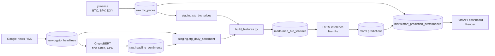

# BTC Prediction Pipeline

Every day at 01:30 UTC a GitHub server I don't pay for wakes up, pulls yesterday's Bitcoin close and a few hundred crypto headlines, scores the headlines with a sentiment model I fine-tuned, rebuilds 27 features, runs an LSTM I wrote from scratch, and publishes the call. My PC is off the whole time.

The model it serves does not beat guessing. The dashboard says that on the front page, right next to the prediction.

That was always the point of this repo. The model lives in [btc-sentiment-predictor](https://github.com/HiyawTaken/btc-sentiment-predictor), along with the story of how I proved it has no edge. This repo is the production system around it: ingestion, a warehouse, transformations, orchestration, inference, and serving. Swapping in a better model later is one file and a rerun.

**Live dashboard:** https://btc-direction-dashboard.onrender.com

---

## How it works



- **Warehouse:** BigQuery, split into `raw`, `staging`, and `marts` datasets. Free tier, and at this data size it will stay free.
- **Transformations:** dbt for the SQL layers. Feature engineering runs in Python on purpose (see below).
- **Orchestration:** an Airflow 3 DAG, executed daily on GitHub Actions with `airflow dags test`.
- **Inference:** the LSTM trained in CuPy, served with a NumPy-only forward pass, so production needs no GPU.
- **Serving:** FastAPI on Render, reading one mart table.

---

## What runs every day

The DAG in `dags/btc_daily_pipeline.py` runs these seven tasks. `ingest_prices` and the news branch run in parallel. Everything after `dbt_staging` waits on both.

| Task | What it does | Writes to |
|---|---|---|
| `ingest_prices` | Pulls daily BTC, SPY, and DXY from yfinance, fills weekend gaps, drops today's unfinished candle | `raw.btc_prices` |
| `ingest_news` | Pulls the last 7 days of crypto headlines from Google News RSS | `raw.crypto_headlines` |
| `label_sentiment` | Scores every headline that has no label yet with the fine-tuned CryptoBERT | `raw.headline_sentiments` |
| `dbt_staging` | Rebuilds the staging views: typed prices and daily sentiment averages | `staging.*` |
| `build_features` | Computes the 27 features with the same code the model trained on | `marts.mart_btc_features` |
| `predict` | Runs the LSTM on the last 30 days of features | `marts.predictions` |
| `dbt_performance` | Scores every past call against the price 3 days later | `marts.mart_prediction_performance` |

Every loader merges on a key, so rerunning any task never duplicates a row. After the DAG finishes, `scripts/verify_run.py` checks that a prediction was actually written during this run. The workflow fails if it wasn't.

---

## Results

As of September 24, 2026, backfilled over every day after the model's training window.

| Metric | Value |
|---|---|
| Predictions stored | 690 (Nov 3, 2024 to Sep 23, 2026) |
| Scored (3-day outcome known) | 687 |
| Model hit rate | 49.6% |
| Always predict "up" | 52.5% |
| Edge | -2.9 points |
| 95% margin of error | ±3.7 points |

The edge sits inside the margin of error. That matches what five separate checks found in the model repo: these features carry no 3-day directional signal. The dashboard shows the live version of this table, and it updates daily.

---

## What I found along the way

**My Snowflake trial ended mid-build.** Every warehouse got suspended and dbt stopped connecting. I moved the warehouse layer to BigQuery and left ingestion and serving alone. The scripts changed their write target and the SQL changed dialect. Nothing about how data flows changed. That migration was the first real test of whether the layers were actually separate, and they were.

**Airflow runs in production without a server.** Free always-on Airflow hosting is mostly gone: Oracle halved its free tier in June 2026, and the managed options cost real money. So GitHub Actions installs Airflow 3.3.2 every morning and runs the real DAG once with `airflow dags test`. Before trusting it, I forced a task to fail. Airflow retried it once, skipped everything downstream, and exited 1, so a broken run turns the workflow red. The tradeoff: there's no always-on web UI.

**Airflow never imports my code.** Every task shells out to a separate virtualenv. dbt, torch, and the BigQuery client all have strong opinions about their dependencies, and Airflow has its own. Keeping them apart means upgrading one can never break the other.

**My first SQL feature mart lied with the right column names.** I first wrote the features as a dbt SQL model. RSI, MACD, EMA, and ATR are recursive, meaning each value depends on the one before it, and SQL window functions can't express that. So my SQL version quietly used plain rolling averages under the same names the model expected. Nothing errored. The model would have received different numbers than it trained on. Feature engineering now lives in `build_features.py`, lifted straight from the training code. The same SQL version had another bug: Snowflake's `LAST_VALUE` defaults to the whole partition, and every SMA came out exactly 1.0.

**The newest candle is always unfinished.** BTC daily candles close at 00:00 UTC. Pulling "today" returns a live price mid-day, and the model never trained on anything like that. Ingestion now drops any day that hasn't closed.

**Headlines came in two date formats.** The historical backfill stores plain dates. RSS stores strings like `Tue, 22 Jul 2026 14:30:00 GMT`. BigQuery's safe parsers return null on anything they can't read, so one whole source could have vanished without a single error. The staging model parses both formats explicitly. I checked afterward: 0 of 61,960 headlines failed to parse.

**The pipeline refuses to predict on stale data.** If ingestion breaks, `predict.py` would happily keep predicting from last week's features. So it raises when the newest feature row is more than 2 days old.

**The dashboard can't touch the warehouse.** It runs on a separate service account that can only read. The page caches results for 10 minutes, so a burst of traffic costs at most one query. If BigQuery is unreachable, it keeps serving the last good result instead of an error page.

---

## Project structure

```
btc-prediction-pipeline/
├── .github/workflows/
│   └── daily-pipeline.yml          # runs the DAG every day at 01:30 UTC
├── dags/
│   └── btc_daily_pipeline.py       # Airflow 3 DAG, 7 tasks
├── dbt/
│   ├── dbt_project.yml
│   ├── profiles.yml                # BigQuery connection, reads env vars only
│   ├── macros/
│   │   └── generate_schema_name.sql
│   └── models/
│       ├── sources.yml
│       ├── staging/
│       │   ├── stg_btc_prices.sql
│       │   └── stg_daily_sentiment.sql
│       └── marts/
│           └── mart_prediction_performance.sql
├── models/
│   ├── lstm_best_30days_horizon.npz  # trained weights
│   └── scaler.json                   # feature order and training mean/std
├── scripts/
│   └── verify_run.py               # fails the run if no fresh prediction landed
├── src/
│   ├── common/
│   │   └── bq.py                   # BigQuery client, loads, and merges
│   ├── ingestion/
│   │   ├── ingest_prices.py
│   │   ├── ingest_news.py
│   │   ├── label_sentiment.py
│   │   ├── build_features.py
│   │   └── load_historical_headlines.py   # one-time backfill
│   ├── inference/
│   │   ├── lstm_numpy.py           # NumPy forward pass
│   │   ├── predict.py
│   │   └── backfill_predictions.py        # one-time backfill
│   └── api/
│       ├── app.py
│       └── templates/index.html
├── Dockerfile.api
├── render.yaml
├── requirements-pipeline.txt
└── requirements-api.txt
```

---

## Run it yourself

You need a GCP project with BigQuery enabled and a service account with **BigQuery Data Editor** and **BigQuery Job User**. Create `raw`, `staging`, and `marts` datasets in one location, then set:

```
GCP_PROJECT_ID=your-project-id
GOOGLE_APPLICATION_CREDENTIALS=/absolute/path/to/key.json
BQ_LOCATION=US
```

The daily run, in dependency order:

```bash
pip install -r requirements-pipeline.txt

python src/ingestion/ingest_prices.py
python src/ingestion/ingest_news.py
python src/ingestion/label_sentiment.py
(cd dbt && dbt run --select staging --profiles-dir .)
python src/ingestion/build_features.py
python src/inference/predict.py
(cd dbt && dbt run --select mart_prediction_performance --profiles-dir .)
```

For a fresh warehouse, load history once before the first daily run. Use `load_historical_headlines.py` with the [labeled headline dataset](https://huggingface.co/datasets/HiyawErtiro/bitcoin-news-sentiments-latest), then `backfill_predictions.py` after features are built.

Dashboard locally:

```bash
pip install -r requirements-api.txt
python -m uvicorn src.api.app:app --reload
```

To run it on GitHub Actions instead, add your service account key as a repository secret named `GCP_SA_KEY`. The workflow handles the rest.


---

## Companion repo

[btc-sentiment-predictor](https://github.com/HiyawTaken/btc-sentiment-predictor) has everything on the modeling side: the from-scratch LSTM, the CryptoBERT fine-tuning, and the evaluation that showed the direction model has no edge.

---

**Project Attribution**

The project's design, architecture, and implementation were completed almost entirely by me. Generative AI tools served only as an educational assistant for concept exploration and small troubleshooting tasks.